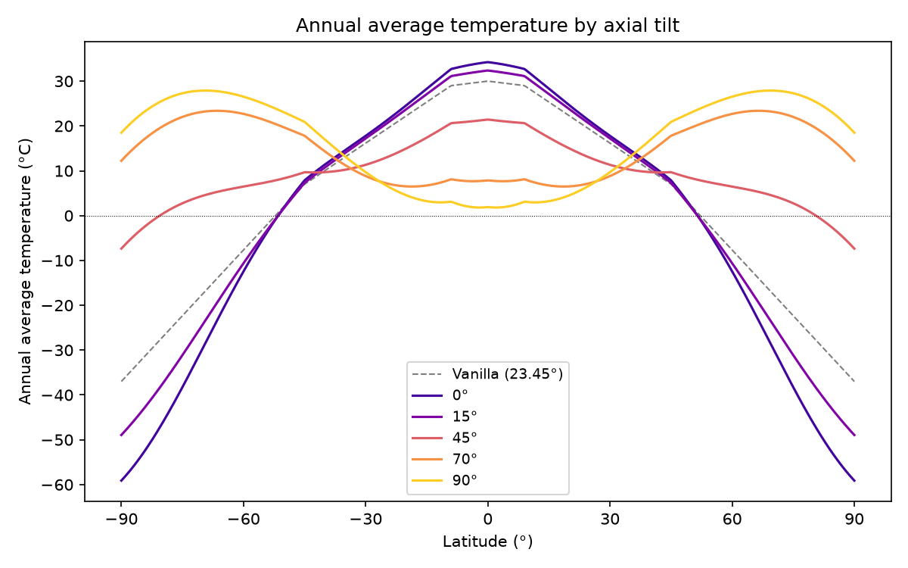
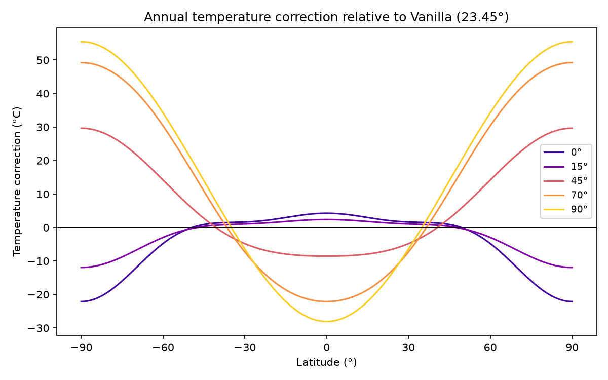
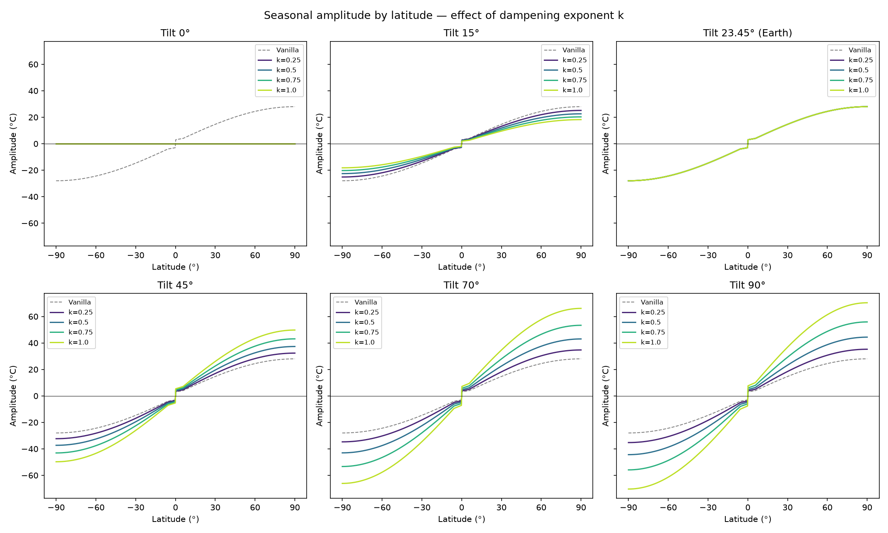
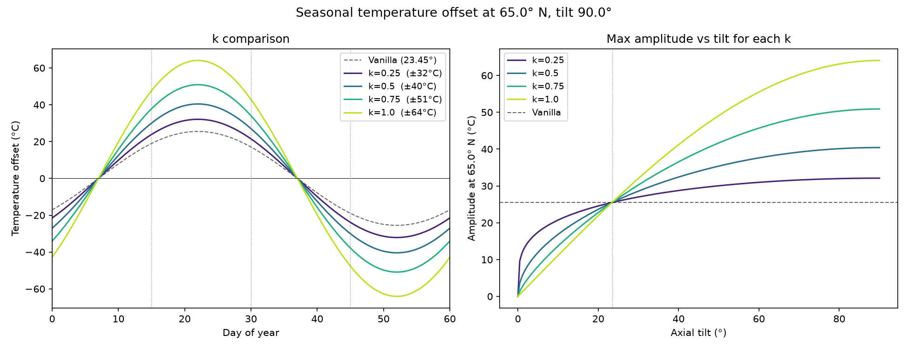
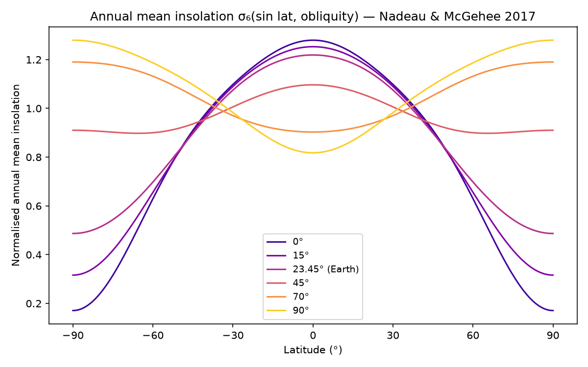
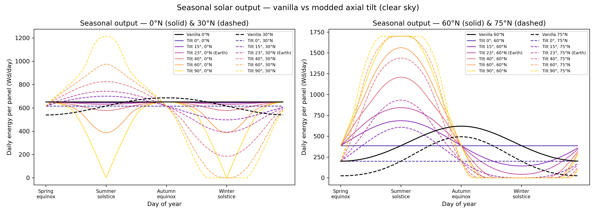
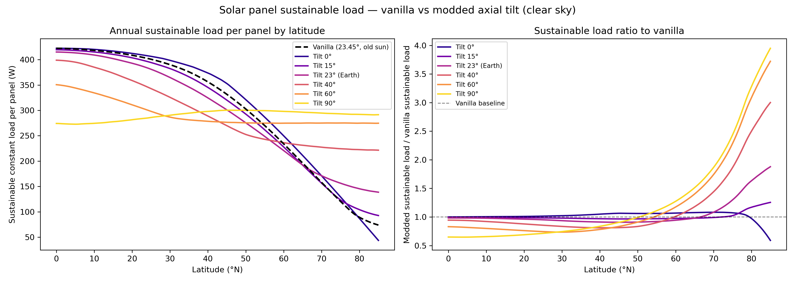
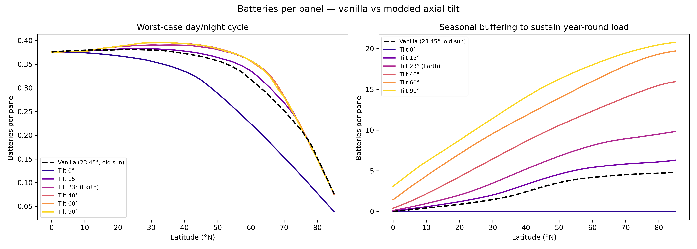
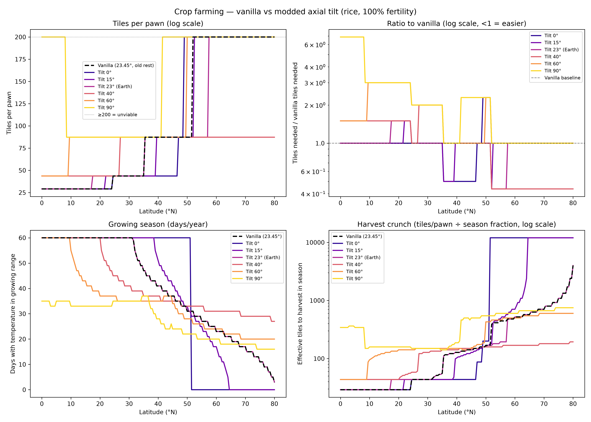

# Realistic Axial Tilt

Replaces RimWorld's approximated sun positioning with geometrically correct axial tilt.
Go from having no seasons at 0° to having extreme seasons at 90°, or anything in between.
This affects biome generation, plant growth, solar production, shadows, and everything downstream of ambient light level.

Please forgive any Claudese in the following, I just wanted to include an analysis making sure we're not breaking the game by doing this. Even the extreme tilts have viable locations, though you have to be more careful than in vanilla, as the extreme are even more so. 
Visiting the poles on a tilt 90° is less bad than going to space, but it's still quite dangerous! 
I may eventually add appropriate biomes and some kind of patching system to select biomes based on temerature extremities, but that would be an expansion involving more compat than I'd like to deal with atm.

## What it does

**Day length varies by latitude and season.**
At extreme latitudes, summers have long days and winters have short ones.
At the equator, days stay near 12 hours year-round.
A 0° tilt gives equal days everywhere; 90° gives midnight sun and polar night for half the year.

**The sun follows a physically correct annual path.**
[Solar declination](https://en.wikipedia.org/wiki/Position_of_the_Sun#Calculations) is computed as `arcsin(sin(ε) × sin(2π×day/60))`, where ε is the axial tilt.

**Seasons are astronomically aligned with the quadrums.**

| Day | Event |
|-----|-------|
| 1 Aprimay (day 0) | Spring equinox |
| 1 Jugust (day 15) | Summer solstice |
| 8 Jugust (day 22) | Peak temperature (thermal lag) |
| 1 Septober (day 30) | Autumn equinox |
| 1 Decembary (day 45) | Winter solstice |
| 8 Decembary (day 52) | Minimum temperature (thermal lag) |

Note that this *does not* match the internal solar calendar, which has solstice on 1st Septober. Instead we shift it to 1st Jugust, so the temperature max lags the solstice by 8 days.

**Seasonal temperature swings scale with insolation.**
[Daily insolation](https://en.wikipedia.org/wiki/Solar_irradiance#Derivation) `H(φ, δ)` is computed via the standard hour-angle integral.
The seasonal amplitude at each latitude is scaled to match the ratio of annual insolation swing between solstices relative to Earth's, raised to a dampening exponent you can set in world gen.

**Annual average temperatures shift with axial tilt.**
At high tilts the poles warm and the equator cools slightly, reshaping biome placement — at 90° there are no polar ice caps; deserts and arid biomes appear instead.
The correction uses the 6th-degree Legendre series approximation to annual mean insolation from [Nadeau & McGehee (2017), *Icarus* 291:46–50](https://arxiv.org/abs/1810.10081), with the underlying insolation formula from [Ward (1974)](https://doi.org/10.1175/1520-0469(1974)031%3C1213:CVOM%3E2.0.CO;2).
At 23.45° (Earth-like tilt) the correction is exactly zero, so vanilla temperatures are preserved.

**Plant rest periods adjust for extended daylight.**
With the optional "Realistic plant rest" setting, the plant resting window shrinks to 22:00–02:00 (4 hours) instead of the vanilla ~11 hours, allowing crops and trees to take advantage of midnight-sun growing seasons at high tilts.

## Analysis plots
### Temperature


Annual average temperature by latitude for several axial tilts (correction applied relative to 23.45°). As you tilt farther, the poles receive more net energy, just distributed wildly across the year.



And more or less the same plot, just subtracting out vanilla average temperature.



This is mostly here to give you an idea of what k does more explicitly. Each plot is for a given tilt, with the temperature for a given latitude at the summer solstice (so lat 90 max and lat -90 min). k=0 is literally vanilla



Seasonal effect of k, along with on the overall max at a given latitude.



more or less a better smoothed version of the first plot.

### Solar Power



Kind of complicated, but gives the daily average power output of a solar panel at various elevations. As you maybe guessed, they way outperform in the summer and under-perform in the winter. Particularly worth noting is the Tilt 23 line, as that's the "normal" rimworld latitude. The peak is shifted because Rimworld inexplicably puts the solar max on Septober 1st, rather than Jugust 1st; the amplitude is also *slightly* higher, but it's nothing to write home about.



average sustainable load per panel, assuming you've built enough batteries for it (good luck getting the right part of the graph!).




The left is the (fraction) of a battery you need to keep the same load overnight. Note this isn't the same thing as using it to sustain the same maximum load. The discrepancy is a problem the grid has IRL, where we actually have the facilities to produce more than 2x what we use on average. The take home is just a single battery per solar panel gets you through the night

On the right is the number of batteries needed to get you through the winter to get the average output in the graph above. There are better options. For a 23 degree tilt, at the pole you need 5 batteries to get an average of 110W.

**Note that batteries are somewhat worse than in vanilla at vanilla tilt**.

Note that batteries per panel is tanking in part because the amount to store is tanking.:w

### Farming balance



Modelled for rice at 100% fertility with the realistic plant rest setting enabled.
Tiles/pawn counts discrete harvests only — partial progress lost to killing frosts (below -18 °C) is not credited.
Plants survive dormant through hot summers (growth stops above 58 °C but the plant does not die), so split spring/fall seasons can still accumulate toward a single harvest.

**Verdict by tilt:**

- **0°** — No seasons; day length is equal everywhere.
Equatorial and mid-latitude farming is unchanged from vanilla.
High latitudes (above ~55°N) lose seasonal temperature variation and become too cold year-round to farm.
- **15°** — Mild seasons. Broadly similar to vanilla; slight improvement at 35–50°N from longer summer days.
- **23° (Earth-like)** — Matches vanilla temperatures by design. Farming difficulty is nearly identical to unmodded, with a modest improvement at high latitudes from longer summer daylight.
- **40°** — Recommended for a meaningful but fair challenge. High-latitude colonies (55–70°N) see dramatically easier farming (fewer tiles/pawn) thanks to longer growing days and milder average temperatures. Equatorial colonies are largely unaffected.
- **60°** — Polar farming becomes genuinely viable. High-latitude locations drop to 20–30 tiles/pawn. Short growing seasons demand careful harvest timing, but the total annual yield is competitive.
- **90°** — Extreme. Equatorial colonies face scorching summers that kill growing seasons. High-latitude colonies enjoy near-continuous summer daylight but brutal polar nights; farming is viable but requires large plots. Not recommended without experience managing the seasonal crunch.

### Generating

To regenerate:

```sh
cd analysis
python3 annual_temperature_plots.py   # annual average plots
python3 temperature_plots.py          # seasonal amplitude plots
python3 crop_yield.py                 # crop yield plot
python3 solar_panels.py               # solar output, seasonal, and battery plots (~40s)
python3 steam_plots.py                # Steam Workshop plots
```

## World gen settings

**Axial Tilt** — 0° to 90°, sticky at 23.45° (Earth-like).
**Axial Effect** (k) — 0 = no effect beyond vanilla; 1 = physically correct.
The in-game UI shows an estimated temperature range (winter low / summer high) at five representative latitudes for the current settings.

## Roadmap

- potential future mod: custom biome definitions tuned for non-Earth tilts (e.g. polar deserts, equatorial tundra)
- potential future mod: adjust plant growth estimates and give yield/year estimates
- potential future mod: make animals skedaddle ofhot maps
- temperature: caching optimisation (trig calls could be done once per map instead of per-tick)
